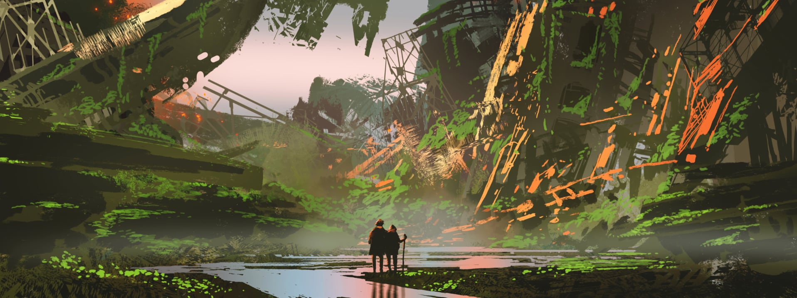

# Contribuindo com o SDK

<figure><figcaption>
Arte por grandfailure
</figcaption></figure>

Como o Cordel Sideral é um projeto aberto, qualquer pessoa pode contribuir com ideias, sugestões, personagens, localidades, histórias... e o que mais desejar :blush:

Ao colaborar, você ajuda a expandir o nosso universo ficcional e possibilita que contemos histórias inspiradas nas suas contribuições, tornando-se parte ativa desse universo.

## Colabore, crie e faça o que desejar

Você pode contribuir da forma com a qual se sentir mais confortável, por exemplo:

* Inscrevendo-se gratuitamente na nossa [newsletter](https://newsletter.cordelsideral.com) e tomando decisões que afetam a história;
* Explorando nosso SDK, uma coletânea de materiais diferentes que descrevem nosso universo ficcional, no site [https://sdk.cordelsideral.com](https://open.cordelsideral.com);
* Fazendo sugestões ao SDK, interagindo conosco nas redes, comunidade, ou enviando um e-mail para [sdk@cordelsideral.com](mailto:sdk@cordelsideral.com);
* Seguindo-nos no [Instagram](https://instagram.com/cordelsideral) e participando de quizzes e outras atividades.

## Fale conosco

Caso tenha alguma dúvida, envie um e-mail para [sdk@cordelsideral.com](mailto:sdk@cordelsideral.com) e te ajudaremos. E lembre-se: qualquer pergunta é válida.
